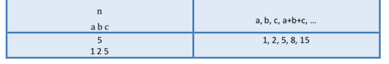

# The-Tribonacci-Sequence
Implementing the the Tribonacci Sequence in C language

As you know, each term of the Fibonacci sequence is obtained from the sum of the previous two terms. For example, the first few terms of the Fibonacci sequence are:

1, 1, 2, 3, 4, 5, 8

Now we want to get acquainted with a new sequence of numbers, Tribonacci, and as it is clear from its name, to obtain each term of this sequence, we must calculate the sum of its three previous terms. For example, Tribonacci's sequence with starting numbers 1, 3 and 4 will be:

1, 3, 4, 8, 15, 27, 50, ...

In this question, we want to do the following:

By taking a positive number n and three initial numbers a, b, n, c, print the first sentence of this sequence.

The inputs and outputs are as below:

